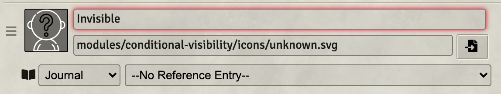

# Conditional Visibility

 

 

Invisible Stalkers should only be seen by players that have cast See Invisibility.  Stealthy Goblins should only be seen by players with high perception.
And when that Drow casts Darkness, players should need Devil's Sight to see any tokens inside.

Conditional Visibility allows you to set conditions on tokens that will display them only to players whose senses meet the conditions necessary to see
the token.

## Installation

It's always easiest to install modules from the in game add-on browser.

To install this module manually:
1.  Inside the Foundry "Configuration and Setup" screen, click "Add-on Modules"
2.  Click "Install Module"
3.  In the "Manifest URL" field, paste the following url:
`https://raw.githubusercontent.com/p4535992/conditional-visibility-new/master/src/module.json`
4.  Click 'Install' and wait for installation to complete
5.  Don't forget to enable the module in game using the "Manage Module" button

### libWrapper

This module uses the [libWrapper](https://github.com/ruipin/fvtt-lib-wrapper) library for wrapping core methods. It is a hard dependency and it is recommended for the best experience and compatibility with other modules.

### socketlib

This module uses the [socketlib](https://github.com/manuelVo/foundryvtt-socketlib) library for wrapping core methods. It is a hard dependency and it is recommended for the best experience and compatibility with other modules.

### ATE (old ATL)

This module uses the ATE library for wrapping methods. It is a hard dependency and it is recommended for the best experience and compatibility with other modules.

## Usage

A usage documentation is reachable [here](./wiki/tutorial.md)

These modules are suggested for a better user experience with this one :

- [Status Icon Tweaks](https://github.com/jessev14/status-icon-tweaks)
- [Temporary Effects as Token Statuses](https://github.com/ElfFriend-DnD/foundryvtt-temp-effects-as-statuses)
- [DFreds Convenient Effects](https://github.com/DFreds/dfreds-convenient-effects)
- [Combat Utility Belt or CUB](https://github.com/death-save/combat-utility-belt)
- [Times up](https://gitlab.com/tposney/times-up)
- [Dae](https://gitlab.com/tposney/dae)
- [Sense Walls Multisystem](https://github.com/p4535992/fvtt-sense-walls-multisystem/) (working)

## Conditions and sense combination by system default

#### [System Dnd5e](./wiki/table_dnd5e.md)
#### [System Pathfinder 2e](./wiki/table_pf2e.md)
#### Did you want ot help with your system prepare some table like the one i do it for Dnd5e for help me to define some rule for your system

## Features

### Module compatibility

- **Integration with [Shared vision](https://github.com/CDeenen/SharedVision/):** The module just wrap on `wrapper` mode this two method `SightLayer.prototype.testVisibility` and `SightLayer.prototype.tokenVision` so it should be no conflict with the levels module.

- **Integration with [Levels](https://github.com/theripper93/Levels):** The module just wrap on `wrapper` mode this two method `SightLayer.prototype.testVisibility` and `SightLayer.prototype.tokenVision` so it should be no conflict with the levels module.

- **Integration with [DFreds Convenient Effects](https://github.com/DFreds/dfreds-convenient-effects):** documentation work in progress, but is basically all automatic so it should work for all senses and conditions are present on the graphic ui of this module.

- **Integration with [Combat Utility Belt or CUB](https://github.com/death-save/combat-utility-belt):** If you use Combat Utility Belt and check "Remove Default Status Effects," it will remove those Status Effects necessary for this module to function.  They can be re-added using Combat Utility Belt's Condition Lab.

If each condition is added to the CUB set, Conditional Visibility will again function, even if CUB has removed the default set.  The pairs would be:

| image | effectId | image path | 
| --- | --- | --- |
| </img> | Hidden | modules/conditional-visibility-new/icons/newspaper.jpg | 
| </img> | Invisible | modules/conditional-visibility-new/icons/unknown.jpg | 
| </img> | Obscured | modules/conditional-visibility-new/icons/foggy.jpg | 
| </img> | In Darkness | modules/conditional-visibility-new/icons/moon.jpg | 

### Apply sense and condition from Token Config

Every sense and condtion can be setted on the token config vision tab, remember the `0` value is the deactivate/default/nullable value, the `-1` is the infinite (the avoid any check because i won anyway) value. 
Depends on the value you set the module will automatically create, updated and remove the active effect on the current token, you can anyway go to edit the active effect manually and change the value and these settings are updated either way.

**NOTE:** Limitation do not use multiple active effects with the same key on the change values `ATCV.<sense or condtion id>`, checkout the [Active effect paragraph on the tutorial](./wiki/tutorial.md)

### [Not reccomended we manage everything with Active effects] Auto-applied from Stealth Rolls and auto appplied hidden

Conditional Visibility contains an setting to auto-apply the hidden condition based on a stealth roll. The reuslt can be differnete depends on the current game system ,contributions for other systems are welcomed.

When this setting is true, then rolling stealth form the HUD config of that token's character sheet will apply the hidden condition based on the value of that roll.

### [On developing or maybe never...] Integration with [Combat utility belt](https://github.com/death-save/combat-utility-belt)

## Api

The API documentation is reachable here [API](./wiki/api.md)

## [Changelog](./CHANGELOG.md)

## Issues

Any issues, bugs, or feature requests are always welcome to be reported directly to the [Issue Tracker](https://github.com/p4535992/conditional-visibility-new/issues ), or using the [Bug Reporter Module](https://foundryvtt.com/packages/bug-reporter/).

## License

This package is under an [MIT license](LICENSE) and the [Foundry Virtual Tabletop Limited License Agreement for module development](https://foundryvtt.com/article/license/).

## Acknowledgements

Bootstrapped with League of Extraordinary FoundryVTT Developers  [foundry-vtt-types](https://github.com/League-of-Foundry-Developers/foundry-vtt-types).

**Icons by**

* unknown.svg, newspaper.svg, and foggy.svg icons made by <a href="https://www.flaticon.com/authors/freepik" title="Freepik">Freepik</a>, from <a href="https://www.flaticon.com/" title="Flaticon"> www.flaticon.com</a>
* moon.svg icon made by <a href="https://www.flaticon.com/authors/iconixar" title="iconixar">iconixar</a> from <a href="https://www.flaticon.com/" title="Flaticon"> www.flaticon.com</a>

## Credit

Thanks to anyone who helps me with this code! I appreciate the user community's feedback on this project!

Very special ty to [Szefo09](https://github.com/szefo09) for make a full operational patch for Dnd5e with FoundryVtt 0.8.6 and 9

Very special ty to [Teshynil](https://github.com/Teshynil) for make many and many test with bug fix
