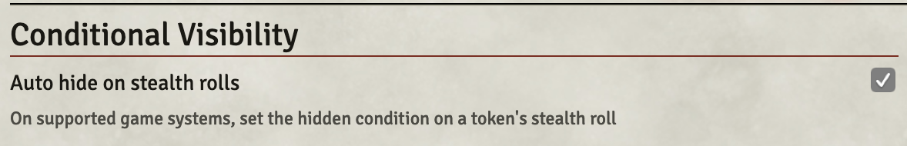

# Conditional Visibility

 

 

Invisible Stalkers should only be seen by players that have cast See Invisibility.  Stealthy Goblins should only be seen by players with high perception.
And when that Drow casts Darkness, players should need Devil's Sight to see any tokens inside.

Conditional Visibility allows you to set conditions on tokens that will display them only to players whose senses meet the conditions necessary to see
the token.

## Suggestion for future developing for anyone want to help

- A integration with the 'levels' module it's seem to be the right road to follow, we can use the method `overrideVisibilityTets(sourceToken, token){}` of levels for override the levels visibility test
- Sync the status with the flags on the token
- With the advent of foundry version 9 it could be done much better by synchronizing it with modules like levels and Active Token Effect.

## Installation

It's always easiest to install modules from the in game add-on browser.

To install this module manually:
1.  Inside the Foundry "Configuration and Setup" screen, click "Add-on Modules"
2.  Click "Install Module"
3.  In the "Manifest URL" field, paste the following url:
`https://raw.githubusercontent.com/p4535992/conditional-visibility/master/src/module.json`
4.  Click 'Install' and wait for installation to complete
5.  Don't forget to enable the module in game using the "Manage Module" button

### libWrapper

This module uses the [libWrapper](https://github.com/ruipin/fvtt-lib-wrapper) library for wrapping core methods. It is a hard dependency and it is recommended for the best experience and compatibility with other modules.

### socketlib

This module uses the [socketlib](https://github.com/manuelVo/foundryvtt-socketlib) library for wrapping core methods. It is a hard dependency and it is recommended for the best experience and compatibility with other modules.

### levels (optional but suggested)

This module uses the [levels](https://github.com/theripper93/Levels) library. It is a optional but suggested dependency and it is recommended for the best experience and compatibility with other modules.

## Usage

A usage documentation is reachable [here](./wiki/tuotrial.md)

## Conditions Panel

### [System Dnd5e](./wiki/table_dnd5e.md)

### [System Pathfinder 2e](./wiki/table_pf2e.md)

## Did you want ot help with your system prepare some table like the one i do it for Dnd5e for help me to define some rule for your system

## Api

The API documentation is reachable here [API](./wiki/api.md)

## Feature

#### Auto-applied from Stealth Rolls

Conditional Visibility contains an setting to auto-apply the hidden condition based on a stealth roll.  Currently only 5e; again, contributions for other systems are welcomed.

When this setting is true, then rolling stealth from that token's character sheet will apply the hidden condition based on the value of that roll.

## Note for Combat Utility Belt Users
If you use Combat Utility Belt and check "Remove Default Status Effects," it will remove those Status Effects necessary for this module to function.  They can be re-added using Combat Utility Belt's Condition Lab:

If each condition is added to the CUB set, Conditional Visibility will again function, even if CUB has removed the default set.  The pairs would be:

| effectId | image path | image |
| --- | --- | --- |
| Invisible | modules/conditional-visibility/icons/unknown.svg | [img](./src/icons/invisible.svg) |
| Obscured | modules/conditional-visibility/icons/foggy.svg | [img](./src/icons/obscured.svg) |
| In Darkness | modules/conditional-visibility/icons/moon.svg | [img](./src/icons/indarkness.svg) |
| Hidden | modules/conditional-visibility/icons/newspaper.svg | [img](./src/icons/hidden.svg) |

## [Changelog](./CHANGELOG.md)

## Issues

Any issues, bugs, or feature requests are always welcome to be reported directly to the [Issue Tracker](https://github.com/p4535992/conditional-visibility/issues ), or using the [Bug Reporter Module](https://foundryvtt.com/packages/bug-reporter/).

## License

This package is under an [MIT license](LICENSE) and the [Foundry Virtual Tabletop Limited License Agreement for module development](https://foundryvtt.com/article/license/).

## Acknowledgements

Bootstrapped with League of Extraordinary FoundryVTT Developers  [foundry-vtt-types](https://github.com/League-of-Foundry-Developers/foundry-vtt-types).

**Icons by**

* unknown.svg, newspaper.svg, and foggy.svg icons made by <a href="https://www.flaticon.com/authors/freepik" title="Freepik">Freepik</a>, from <a href="https://www.flaticon.com/" title="Flaticon"> www.flaticon.com</a>
* moon.svg icon made by <a href="https://www.flaticon.com/authors/iconixar" title="iconixar">iconixar</a> from <a href="https://www.flaticon.com/" title="Flaticon"> www.flaticon.com</a>

## Credit

Thanks to anyone who helps me with this code! I appreciate the user community's feedback on this project!

Very special ty to [Szefo09](https://github.com/szefo09) for make a full operational patch for Dnd5e with FoundryVtt 0.8.6 and 9

Very special ty to [Teshynil](https://github.com/Teshynil) for make many and many test with bug fix
